# DIAGRAMA DE FLUJO COMPLETO - Chat Tecnos

## Diagrama Principal (Mermaid)

```mermaid
flowchart TD
    START([Usuario inicia chat]) --> GREETING[📋 Greeting: Mostrar Política de Privacidad]
    GREETING --> GDPR{Usuario acepta términos?}
    
    GDPR -->|No acepta| GDPR_REJECT[❌ Rechazo: Mostrar mensaje de rechazo]
    GDPR_REJECT --> END_REJECT([Chat finalizado])
    
    GDPR -->|Acepta| LANGUAGE[🌐 Seleccionar Idioma]
    LANGUAGE --> LANG_CHOICE{Usuario selecciona idioma}
    
    LANG_CHOICE -->|Español| LANG_ES[Idioma: Español]
    LANG_CHOICE -->|English| LANG_EN[Idioma: Inglés]
    LANG_CHOICE -->|No selecciona| LANGUAGE
    
    LANG_ES --> NAME[👤 Preguntar Nombre]
    LANG_EN --> NAME
    
    NAME --> NAME_INPUT{Usuario escribe nombre?}
    NAME_INPUT -->|Nombre válido 2-30 caracteres| NAME_OK[Guardar nombre]
    NAME_INPUT -->|Nombre inválido| NAME
    
    NAME_OK --> LEVEL[📊 Seleccionar Nivel Técnico]
    LEVEL --> LEVEL_CHOICE{Usuario selecciona nivel}
    
    LEVEL_CHOICE -->|Básico| LEVEL_BASIC[Nivel: Básico]
    LEVEL_CHOICE -->|Intermedio| LEVEL_INTER[Nivel: Intermedio]
    LEVEL_CHOICE -->|Avanzado| LEVEL_ADV[Nivel: Avanzado]
    LEVEL_CHOICE -->|No selecciona| LEVEL
    
    LEVEL_BASIC --> NEED[❓ Pregunta Abierta: ¿En qué puedo ayudarte hoy?]
    LEVEL_INTER --> NEED
    LEVEL_ADV --> NEED
    
    NEED --> NEED_INPUT{Usuario describe problema?}
    NEED_INPUT -->|Sí, escribe texto| NEED_TEXT[Guardar problem_raw]
    NEED_INPUT -->|No, sin texto| NEED
    
    NEED_TEXT --> OPENAI[🤖 OpenAI: Validar y clasificar problema]
    OPENAI --> OPENAI_RESULT{Análisis OpenAI}
    
    OPENAI_RESULT -->|Timeout/Error| OPENAI_FAIL[Fallback: Pedir dispositivo]
    OPENAI_RESULT -->|Éxito| OPENAI_OK[Intent detectado + faltantes]
    
    OPENAI_FAIL --> DEVICE[💻 Preguntar Tipo de Dispositivo]
    OPENAI_OK --> DEVICE_CHECK{¿Falta device_type?}
    
    DEVICE_CHECK -->|Sí| DEVICE
    DEVICE_CHECK -->|No, pero es unknown| INFER[Inferir dispositivo del texto]
    DEVICE_CHECK -->|No, ya existe| DIAG_AUTO[🚀 Iniciar Diagnóstico Automáticamente]
    
    INFER --> INFER_RESULT{¿Se pudo inferir?}
    INFER_RESULT -->|Sí notebook/laptop| DEVICE_NOTEBOOK[device_type = notebook]
    INFER_RESULT -->|Sí desktop/escritorio| DEVICE_DESKTOP[device_type = desktop]
    INFER_RESULT -->|Sí all-in-one| DEVICE_ALLINONE[device_type = allinone]
    INFER_RESULT -->|No| DEVICE
    
    DEVICE_NOTEBOOK --> DIAG_AUTO
    DEVICE_DESKTOP --> DIAG_AUTO
    DEVICE_ALLINONE --> DIAG_AUTO
    
    DEVICE --> DEVICE_CHOICE{Usuario selecciona dispositivo}
    DEVICE_CHOICE -->|PC de escritorio| DEVICE_DESKTOP
    DEVICE_CHOICE -->|Notebook| DEVICE_NOTEBOOK
    DEVICE_CHOICE -->|All In One| DEVICE_ALLINONE
    DEVICE_CHOICE -->|No selecciona| DEVICE
    
    DIAG_AUTO --> DIAG_STEP1[🔍 DIAGNOSTIC_STEP: Paso 1 Automático]
    DIAG_STEP1 --> DIAG_Q1[Pregunta: ¿Qué pasa al presionar encendido?]
    DIAG_Q1 --> DIAG_BTNS1[Botones: Sin señales / Luces-Ventilador / Pitidos / Enciende-Apaga]
    
    DIAG_BTNS1 --> DIAG_SYMPTOM{Usuario selecciona síntoma}
    
    DIAG_SYMPTOM -->|Sin señales| DIAG_P2_NO[Paso 2: Revisar alimentación/cable]
    DIAG_SYMPTOM -->|Luces/Ventilador| DIAG_P2_PWR[Paso 2: Revisar monitor/cables]
    DIAG_SYMPTOM -->|Pitidos| DIAG_P2_PWR
    DIAG_SYMPTOM -->|Enciende-Apaga| DIAG_P2_ONOFF[Paso 2: Revisar sobrecalentamiento]
    
    DIAG_P2_NO --> DIAG_BTNS2[Botones: Listo probé / Sigue igual / Necesito ayuda]
    DIAG_P2_PWR --> DIAG_FILTER{¿Nivel usuario?}
    DIAG_P2_ONOFF --> DIAG_BTNS2
    
    DIAG_FILTER -->|Básico/Intermedio| DIAG_P2_PWR_SAFE[Paso 2: Solo acciones externas<br/>NO mencionar RAM/abrir PC]
    DIAG_FILTER -->|Avanzado| DIAG_P2_PWR_ADV[Paso 2: Incluir revisar RAM<br/>Preguntar si se siente cómodo]
    
    DIAG_P2_PWR_SAFE --> DIAG_BTNS2
    DIAG_P2_PWR_ADV --> DIAG_BTNS2
    
    DIAG_BTNS2 --> DIAG_RESULT{Usuario responde}
    
    DIAG_RESULT -->|Listo probé| DIAG_CONFIRM[Preguntar: ¿Se resolvió?]
    DIAG_CONFIRM --> DIAG_CONFIRM_BTNS[Botones: Se resolvió / Sigue igual / Necesito ayuda]
    
    DIAG_CONFIRM_BTNS --> DIAG_CONFIRM_CHOICE{Usuario responde}
    DIAG_CONFIRM_CHOICE -->|Se resolvió| FEEDBACK
    DIAG_CONFIRM_CHOICE -->|Sigue igual| DIAG_STILL[Contar still_count]
    DIAG_CONFIRM_CHOICE -->|Necesito ayuda| ESCALATE
    
    DIAG_RESULT -->|Sigue igual| DIAG_STILL
    DIAG_RESULT -->|Necesito ayuda| ESCALATE
    
    DIAG_STILL --> DIAG_STILL_CHECK{still_count >= 2?}
    DIAG_STILL_CHECK -->|Sí| ESCALATE
    DIAG_STILL_CHECK -->|No| DIAG_NEXT[Paso siguiente]
    
    DIAG_NEXT --> DIAG_NEXT_FILTER{¿Nivel usuario?}
    DIAG_NEXT_FILTER -->|Básico/Intermedio| DIAG_NEXT_SAFE[Paso: Solo acciones externas<br/>Recomendar técnico si persiste]
    DIAG_NEXT_FILTER -->|Avanzado| DIAG_NEXT_ADV[Paso: Puede incluir abrir dispositivo<br/>Con advertencia y alternativa]
    
    DIAG_NEXT_SAFE --> DIAG_BTNS2
    DIAG_NEXT_ADV --> DIAG_BTNS2
    
    ESCALATE --> FEEDBACK[💬 Feedback Requerido]
    
    FEEDBACK --> FEEDBACK_CHOICE{Usuario responde}
    FEEDBACK_CHOICE -->|👍 Sí, me sirvió| FEEDBACK_YES[Guardar feedback positivo]
    FEEDBACK_CHOICE -->|👎 No, no me sirvió| FEEDBACK_REASON[Preguntar motivo]
    FEEDBACK_CHOICE -->|No responde| FEEDBACK
    
    FEEDBACK_YES --> END_POSITIVE([✅ Chat finalizado - Feedback positivo])
    
    FEEDBACK_REASON --> REASON_CHOICE{Usuario selecciona motivo}
    REASON_CHOICE -->|No resolvió| REASON_SAVE[Guardar motivo]
    REASON_CHOICE -->|Difícil entender| REASON_SAVE
    REASON_CHOICE -->|Demasiados pasos| REASON_SAVE
    REASON_CHOICE -->|Quería técnico| REASON_SAVE
    REASON_CHOICE -->|Otro| REASON_SAVE
    REASON_CHOICE -->|No responde| FEEDBACK_REASON
    
    REASON_SAVE --> END_NEGATIVE([❌ Chat finalizado - Feedback negativo])
    
    style START fill:#90EE90
    style END_POSITIVE fill:#90EE90
    style END_NEGATIVE fill:#FFB6C1
    style END_REJECT fill:#FFB6C1
    style OPENAI fill:#FFD700
    style DIAG_AUTO fill:#87CEEB
    style ESCALATE fill:#FFA500
    style FEEDBACK fill:#9370DB
```

## Descripción Detallada de Cada Etapa

### 1. INICIO DEL CHAT
- **Trigger**: Usuario accede a `/api/greeting`
- **Acción**: Crear sesión nueva con `stage: 'ASK_LANGUAGE'`
- **Respuesta**: Mostrar política de privacidad bilingüe
- **Botones**: "Sí Acepto" / "No Acepto"
- **Espera usuario**: ✅ SÍ (debe aceptar o rechazar)

### 2. CONSENTIMIENTO GDPR
- **Trigger**: Usuario hace clic en "Sí Acepto" o escribe "sí/yes/acepto/accept"
- **Acción**: Guardar `gdprConsent: true`
- **Transición**: `ASK_LANGUAGE` → `ASK_LANGUAGE` (muestra botones de idioma)
- **Espera usuario**: ✅ SÍ (debe seleccionar idioma)

### 3. SELECCIÓN DE IDIOMA
- **Trigger**: Usuario hace clic en botón de idioma o escribe "español/english"
- **Acción**: Guardar `userLocale: 'es-AR'` o `'en-US'`
- **Transición**: `ASK_LANGUAGE` → `ASK_NAME`
- **Respuesta automática**: Mensaje de confirmación en el idioma seleccionado
- **Espera usuario**: ✅ SÍ (debe escribir nombre)

### 4. CAPTURA DE NOMBRE
- **Trigger**: Usuario escribe texto
- **Validación**: Nombre debe tener 2-30 caracteres (toma primera palabra)
- **Acción**: Guardar `userName`
- **Transición**: `ASK_NAME` → `ASK_USER_LEVEL`
- **Respuesta automática**: Saludo personalizado + pregunta por nivel
- **Espera usuario**: ✅ SÍ (debe seleccionar nivel)

### 5. SELECCIÓN DE NIVEL TÉCNICO
- **Trigger**: Usuario hace clic en botón o escribe "básico/intermedio/avanzado"
- **Acción**: Guardar `userLevel: 'basic' | 'intermediate' | 'advanced'`
- **Transición**: `ASK_USER_LEVEL` → `ASK_NEED`
- **Respuesta automática**: Confirmación + pregunta abierta
- **Espera usuario**: ✅ SÍ (debe describir problema)

### 6. SOLICITUD DEL PROBLEMA (ASK_NEED)
- **Trigger**: Usuario escribe descripción del problema
- **Acción**: Guardar `problem_raw`
- **Transición**: `ASK_NEED` → `ASK_PROBLEM` (llama a `handleAskProblemStage`)
- **Espera usuario**: ✅ SÍ (debe escribir problema)
- **Nota**: NO hay botones, es pregunta abierta

### 7. VALIDACIÓN DEL PROBLEMA (ASK_PROBLEM)
- **Trigger**: Automático después de guardar `problem_raw`
- **Acción**: Llamar a OpenAI con timeout de 12 segundos
- **OpenAI analiza**:
  - `valid`: ¿Es problema técnico válido?
  - `intent`: Intent canónico (wont_turn_on, no_internet, etc.)
  - `missing_device`: ¿Falta tipo de dispositivo?
  - `missing_os`: ¿Falta sistema operativo?
  - `needs_clarification`: ¿Necesita más detalles?
- **Transiciones posibles**:
  - Si `missing_device === true` → `ASK_DEVICE`
  - Si `device_type` es `unknown` → Intentar inferir del texto
  - Si se puede inferir → `DIAGNOSTIC_STEP` (automático)
  - Si no se puede inferir → `ASK_DEVICE`
  - Si timeout/error → `ASK_DEVICE` (fallback)
- **Espera usuario**: ❌ NO (proceso automático)

### 8. IDENTIFICACIÓN DEL DISPOSITIVO (ASK_DEVICE)
- **Trigger**: 
  - OpenAI indica `missing_device: true`
  - No se pudo inferir dispositivo del texto
  - Fallback por error de OpenAI
- **Botones**: "PC de escritorio" / "Notebook" / "All In One"
- **Acción**: Guardar `device_type`
- **Transición**: `ASK_DEVICE` → `DIAGNOSTIC_STEP` (automático)
- **Espera usuario**: ✅ SÍ (debe seleccionar dispositivo)

### 9. ENTRADA AL DIAGNÓSTICO (DIAGNOSTIC_STEP)
- **Trigger**: Automático después de tener `device_type` e `intent`
- **Acción**: Llamar a `handleDiagnosticStepStage` con `buttonToken=null`
- **Resultado**: Genera automáticamente el Paso 1
- **Espera usuario**: ❌ NO (responde automáticamente con primer paso)

### 10. FLUJO DE DIAGNÓSTICO PASO A PASO

#### Paso 1 (Automático)
- **Pregunta**: "Cuando apretás el botón de encendido, ¿qué pasa?"
- **Botones**:
  - "No enciende nada (sin luces ni ventilador)"
  - "Prenden luces o gira el ventilador"
  - "Escucho pitidos (beeps)"
  - "Enciende y se apaga enseguida"
- **Espera usuario**: ✅ SÍ (debe seleccionar síntoma)

#### Paso 2 (Según síntoma seleccionado)
- **Si "Sin señales"**:
  - Instrucciones: Revisar cable, enchufe, interruptor fuente
  - Botones: "Listo, probé esto" / "Sigue igual" / "No puedo hacerlo"
  
- **Si "Luces/Ventilador" o "Pitidos"**:
  - **Filtrado por nivel**:
    - **Básico/Intermedio**: Solo acciones externas (monitor, cables externos)
      - NO menciona RAM ni abrir PC
    - **Avanzado**: Incluye revisar RAM (con advertencia)
  - Botones: "Listo, probé esto" / "Sigue igual" / "No puedo hacerlo"
  
- **Si "Enciende-Apaga"**:
  - Instrucciones: Revisar sobrecalentamiento, dispositivos USB, fuente
  - Botones: "Listo, probé esto" / "Sigue igual" / "No puedo hacerlo"

#### Paso 3+ (Según respuesta del usuario)

**Si usuario presiona "Listo, probé esto"**:
- NO cierra inmediatamente
- Pregunta: "¿Esto resolvió el problema?"
- Botones: "Se resolvió" / "Sigue igual" / "Necesito ayuda"
- Si "Se resolvió" → `FEEDBACK_REQUIRED`
- Si "Sigue igual" → Continuar con siguiente paso
- Si "Necesito ayuda" → `FEEDBACK_REQUIRED` (escalamiento)

**Si usuario presiona "Sigue igual"**:
- Incrementar `still_count`
- Si `still_count >= 2` → `FEEDBACK_REQUIRED` (escalamiento)
- Si `still_count < 2` → Continuar con siguiente paso
  - **Filtrado por nivel**:
    - **Básico/Intermedio**: Solo acciones externas, recomendar técnico si persiste
    - **Avanzado**: Puede incluir abrir dispositivo (con advertencia)

**Si usuario presiona "No puedo hacerlo / Necesito ayuda"**:
- Escalamiento inmediato → `FEEDBACK_REQUIRED`

### 11. ESCALAMIENTO A TÉCNICO
- **Condiciones**:
  - Usuario presiona "No puedo hacerlo / Necesito ayuda"
  - `still_count >= 2` (problema persiste después de 2 intentos)
- **Transición**: `DIAGNOSTIC_STEP` → `FEEDBACK_REQUIRED`
- **Mensaje**: Recomendar hablar con técnico + pedir feedback

### 12. FEEDBACK FINAL (FEEDBACK_REQUIRED)
- **Trigger**: 
  - Usuario resuelve problema (`BTN_SOLVED`)
  - Escalamiento a técnico
- **Botones**: "👍 Sí, me sirvió" / "👎 No, no me sirvió"
- **Espera usuario**: ✅ SÍ (debe dar feedback)

**Si "Sí, me sirvió"**:
- Guardar `feedback: 'positive'`
- Transición: `FEEDBACK_REQUIRED` → `ENDED`
- Mensaje: Agradecimiento y cierre

**Si "No, no me sirvió"**:
- Transición: `FEEDBACK_REQUIRED` → `FEEDBACK_REASON`
- Preguntar motivo

### 13. MOTIVO DEL FEEDBACK NEGATIVO (FEEDBACK_REASON)
- **Botones**:
  - "No resolvió el problema"
  - "Fue difícil de entender"
  - "Demasiados pasos"
  - "Prefería hablar con un técnico"
  - "Otro motivo"
- **Acción**: Guardar `feedback: 'negative'` y `feedback_reason`
- **Transición**: `FEEDBACK_REASON` → `ENDED`
- **Espera usuario**: ✅ SÍ (debe seleccionar motivo)

### 14. CIERRE DEL CHAT (ENDED)
- **Estado final**: No más interacciones
- **Datos guardados**:
  - `feedback` (positive/negative)
  - `feedback_reason` (si aplica)
  - `intent`
  - `device_type`
  - `userLevel`
  - `diagnostic.step` (cantidad de pasos)
  - `diagnostic.data` (datos del diagnóstico)

## Puntos Críticos de Espera del Usuario

### ✅ El bot ESPERA input del usuario en:
1. **GDPR Consent**: Debe aceptar o rechazar
2. **Selección de Idioma**: Debe elegir idioma
3. **Captura de Nombre**: Debe escribir nombre válido
4. **Selección de Nivel**: Debe elegir nivel técnico
5. **Descripción del Problema**: Debe escribir problema
6. **Selección de Dispositivo**: Si no se puede inferir
7. **Cada paso de diagnóstico**: Debe seleccionar síntoma o responder a instrucciones
8. **Feedback**: Debe dar feedback positivo/negativo
9. **Motivo del feedback negativo**: Si es negativo, debe seleccionar motivo

### ❌ El bot NO espera (responde automáticamente):
1. **Validación del problema con OpenAI**: Proceso automático (puede tomar hasta 12s)
2. **Inferencia de dispositivo**: Si se puede inferir del texto, avanza automáticamente
3. **Inicio del diagnóstico**: Al tener `device_type` e `intent`, genera automáticamente el Paso 1
4. **Transiciones entre pasos**: Cuando el usuario responde, avanza automáticamente al siguiente paso

## Filtrado por Nivel de Usuario

### Básico e Intermedio
- ❌ **PROHIBIDO**: Abrir dispositivo, tocar RAM, placa madre, fuente, discos, CMOS
- ✅ **PERMITIDO**: Observación externa, revisar monitor, probar enchufes, desconectar periféricos externos
- **En Paso 2 (Luces/Ventilador)**: Solo menciona acciones externas (monitor, cables externos)
- **En pasos siguientes**: Solo acciones externas, recomendar técnico si persiste

### Avanzado
- ✅ **PERMITIDO**: Abrir dispositivo, revisar RAM, clear CMOS, pruebas internas
- **Condiciones**: Siempre pregunta si se siente cómodo, advierte riesgo, ofrece alternativa de técnico
- **En Paso 2 (Luces/Ventilador)**: Puede mencionar revisar RAM (con advertencia)
- **En pasos siguientes**: Puede incluir acciones internas (con advertencia)

## Posibles Bloqueos y Problemas

### 1. Bloqueo en ASK_NEED
- **Causa**: Usuario no escribe nada
- **Solución**: Bot repite pregunta (no hay timeout)

### 2. Bloqueo en OpenAI
- **Causa**: Timeout de 12 segundos o error de red
- **Solución**: Fallback automático a `ASK_DEVICE`

### 3. Bloqueo en DIAGNOSTIC_STEP sin device_type
- **Causa**: `device_type` es `unknown` o `undefined`
- **Solución**: Gate que redirige a `ASK_DEVICE`

### 4. Bloqueo en pasos de diagnóstico
- **Causa**: Usuario no responde a botones
- **Solución**: Bot permanece en mismo paso hasta respuesta

### 5. Bloqueo en Feedback
- **Causa**: Usuario no da feedback
- **Solución**: Bot repite pregunta (no hay timeout)

## Flujos Alternativos

### Flujo con OS (Opcional)
- Si OpenAI indica `missing_os: true` y el dispositivo está encendido:
  - `ASK_DEVICE` → `ASK_OS` → `DIAGNOSTIC_STEP`
- Si `missing_os: false` o dispositivo no enciende:
  - `ASK_DEVICE` → `DIAGNOSTIC_STEP` (salta OS)

### Flujo con Rechazo GDPR
- Usuario rechaza términos → Mensaje de rechazo → Chat finalizado
- No se guarda información

### Flujo con Problema No Válido
- OpenAI indica `valid: false` → Se trata como `missing_device: true` → `ASK_DEVICE`

## Notas Técnicas

- **Timeout OpenAI**: 12 segundos máximo
- **Reset de diagnostic**: Se resetea cuando hay un nuevo problema (`session.diagnostic = null`)
- **Path de diagnóstico**: `"${intent}:${device_type}"` (ej: "wont_turn_on:desktop")
- **Still count**: Se incrementa cada vez que usuario presiona "Sigue igual"
- **Escalamiento**: Automático si `still_count >= 2` o si usuario presiona "Necesito ayuda"

