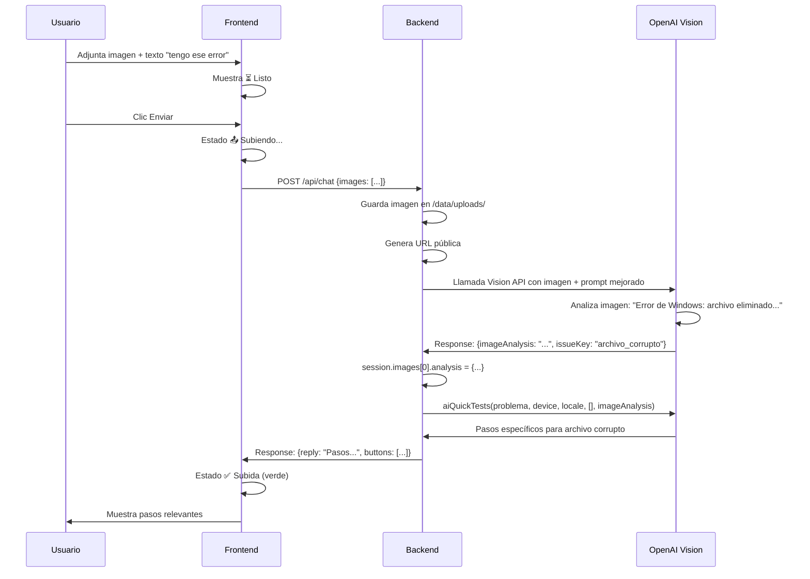

# FIX CRÍTICO: OpenAI Vision API - Análisis de Imágenes

## 🚨 Problema Identificado

**ANTES:**
- ✅ Frontend enviaba imágenes correctamente
- ✅ Backend guardaba imágenes en `/data/uploads/`
- ✅ URLs públicas generadas
- ✅ Vision API se llamaba con las imágenes
- ❌ **OpenAI NO analizaba el contenido de las imágenes**
- ❌ **Se clasificaba solo con el texto del usuario**

**Ejemplo del Bug:**
```
👤 Usuario: "Tengo ese error al abrir un archivo"
🖼️ Imagen: Error de Windows "Se eliminó el elemento..."
🤖 Bot: "problemas de conexión a internet" ❌ INCORRECTO
```

---

## 🔍 Causa Raíz

El prompt de `analyzeProblemWithOA()` estaba diseñado SOLO para **clasificar** el problema en categorías predefinidas, pero **NO le pedía a GPT-4o que DESCRIBIERA qué veía en la imagen**.

**Flujo anterior:**
1. Frontend envía imagen + texto → ✅
2. Backend guarda imagen → ✅
3. `analyzeProblemWithOA()` recibe URL de imagen → ✅
4. Vision API recibe imagen → ✅
5. Prompt dice: "Clasifica esto en categorías" → ⚠️ Demasiado vago
6. GPT-4o responde solo basándose en el texto → ❌

**Resultado:** La imagen se ignoraba o se usaba mínimamente.

---

## ✅ Solución Implementada

### **1. Prompt Mejorado para Vision API**

**Se agregó una sección especial cuando hay imágenes:**

```javascript
// ANTES: Prompt genérico
const prompt = 'Analizá el siguiente mensaje y clasificalo...';

// AHORA: Prompt con énfasis en imagen
if (imageUrls.length > 0) {
  promptIntro = `
  🖼️ ⚠️ ATENCIÓN: El usuario adjuntó imagen(es) del problema.
  
  INSTRUCCIONES ESPECIALES PARA IMÁGENES:
  1. PRIMERO describe en detalle qué ves en la imagen
  2. Identifica mensajes de error, ventanas, iconos, texto visible
  3. LUEGO combina esa información con el texto del usuario
  4. Finalmente clasifica basándote en AMBOS: imagen + texto
  
  ⚠️ IMPORTANTE: La imagen tiene PRIORIDAD sobre el texto del usuario.
  Si el usuario dice algo vago como "tengo ese error" pero la imagen muestra
  un error específico (ej: archivo corrupto), usa la información de la IMAGEN.
  
  Ejemplos:
  ━━━━━━━━━━━━━━━━━━━━━━━━━━━━━━━━━━━━━━━━━━
  📝 Usuario: "tengo ese error al abrir un archivo"
  🖼️ Imagen: Ventana de Windows con mensaje "Se eliminó el elemento..."
  ✅ Clasificación: isProblem:true, issueKey:"archivo_corrupto", device:"pc"
  
  📝 Usuario: "problemas con la pantalla"
  🖼️ Imagen: Pantalla azul de Windows (BSOD) con STOP code
  ✅ Clasificación: isProblem:true, issueKey:"error_pantalla", device:"pc"
  ━━━━━━━━━━━━━━━━━━━━━━━━━━━━━━━━━━━━━━━━━━
  
  🔍 ANÁLISIS DE LA IMAGEN:
  (Describe aquí qué ves en la imagen antes de clasificar)
  `;
}
```

---

### **2. Nuevo Campo en JSON Response: `imageAnalysis`**

```json
{
  "imageAnalysis": "Veo una ventana de Windows con el mensaje 'Se eliminó el elemento...'",
  "isIT": true,
  "isProblem": true,
  "device": "pc",
  "issueKey": "archivo_corrupto",
  "confidence": 0.95
}
```

**Código:**
```javascript
// En analyzeProblemWithOA()
const imageAnalysis = typeof parsed.imageAnalysis === 'string' 
  ? parsed.imageAnalysis 
  : null;

if (imageAnalysis) {
  console.log('[analyzeProblemWithOA] 🖼️ Análisis de imagen:', imageAnalysis);
}

return { 
  isIT, isProblem, isHowTo, 
  device, issueKey, confidence, 
  imageAnalysis // <-- NUEVO CAMPO
};
```

---

### **3. Almacenar Análisis en la Sesión**

```javascript
// En el endpoint /api/chat, después de analyzeProblemWithOA()
if (savedImageUrls.length > 0 && ai.imageAnalysis) {
  console.log('[ASK_PROBLEM] Guardando análisis de imagen:', ai.imageAnalysis);
  
  if (session.images && session.images.length > 0) {
    const lastImageIndex = session.images.length - 1;
    session.images[lastImageIndex].analysis = {
      problemDetected: ai.imageAnalysis,
      errorMessages: [],
      technicalDetails: ai.imageAnalysis,
      issueKey: ai.issueKey || 'generic',
      device: ai.device || null
    };
  }
}
```

**Estructura en sesión:**
```javascript
session.images = [
  {
    url: "https://sti-rosario-ai.onrender.com/uploads/web-xxx.jpg",
    timestamp: "2025-12-04T03:33:36.000Z",
    analysis: {
      problemDetected: "Error de Windows: archivo corrupto",
      errorMessages: [],
      technicalDetails: "...",
      issueKey: "archivo_corrupto",
      device: "pc"
    }
  }
];
```

---

### **4. Pasos de Diagnóstico Relevantes**

**Modificación en `aiQuickTests()`:**

```javascript
// ANTES:
async function aiQuickTests(problemText, device, locale, avoidSteps) {
  // ...
}

// AHORA:
async function aiQuickTests(problemText, device, locale, avoidSteps, imageAnalysis) {
  // Agregar contexto de imagen al prompt
  let imageContext = '';
  if (imageAnalysis) {
    imageContext = `
    ━━━━━━━━━━━━━━━━━━━━━━━━━━━━━━━━━━━━━━━━━━
    🖼️ ANÁLISIS DE IMAGEN ADJUNTA:
    ${imageAnalysis}
    ━━━━━━━━━━━━━━━━━━━━━━━━━━━━━━━━━━━━━━━━━━
    
    ⚠️ IMPORTANTE: Los pasos deben ser ESPECÍFICOS para el error mostrado en la imagen.
    NO generes pasos genéricos de reiniciar o revisar cables si la imagen muestra
    un error específico (ej: archivo corrupto, error de permisos, pantalla azul).
    `;
  }
  
  const prompt = [
    'Generá una lista de pasos...',
    imageContext, // <-- INCLUIR AQUÍ
    '...'
  ].join('\n');
}
```

**Llamada actualizada:**
```javascript
// En generateAndShowSteps()
let imageAnalysisText = null;
if (session.images && session.images.length > 0) {
  const latestImage = session.images[session.images.length - 1];
  if (latestImage.analysis && latestImage.analysis.problemDetected) {
    imageAnalysisText = latestImage.analysis.problemDetected;
  }
}

aiSteps = await aiQuickTests(
  problemWithContext, 
  device, 
  locale, 
  avoidSteps,
  imageAnalysisText // <-- NUEVO PARÁMETRO
);
```

---

### **5. Nuevos `issueKey` para Errores Comunes**

Se agregaron categorías específicas para problemas detectables visualmente:

```javascript
'issueKey': 
  "no_prende" | 
  "boot_issue" | 
  "wifi_connectivity" | 
  "no_funciona" | 
  "error_config" | 
  "error_archivo" |        // <-- NUEVO
  "archivo_corrupto" |     // <-- NUEVO
  "error_pantalla" |       // <-- NUEVO
  "install_guide" | 
  "setup_guide" | 
  "connect_guide" | 
  "generic" | 
  null
```

**Ejemplos en el prompt:**
```
'- "error al abrir archivo" (imagen muestra archivo corrupto) 
    → isIT:true, isProblem:true, device:"pc", issueKey:"archivo_corrupto"'

'- "pantalla azul de Windows" (imagen muestra BSOD) 
    → isIT:true, isProblem:true, device:"pc", issueKey:"error_pantalla"'
```

---

## 📊 Comparación Antes/Después

### **Caso de Prueba: Error de Archivo Corrupto**

| Aspecto | ANTES | DESPUÉS |
|---------|-------|---------|
| **Texto usuario** | "Tengo ese error al abrir un archivo" | "Tengo ese error al abrir un archivo" |
| **Imagen** | Error Windows "Se eliminó el elemento..." | Error Windows "Se eliminó el elemento..." |
| **Análisis OpenAI** | Solo texto → "problema vago" | Imagen + texto → "archivo corrupto" |
| **Clasificación** | `issueKey: "wifi_connectivity"` ❌ | `issueKey: "archivo_corrupto"` ✅ |
| **Pasos sugeridos** | "Reiniciar router, revisar cables..." ❌ | "Restaurar archivo, verificar papelera..." ✅ |

---

## 🔧 Archivos Modificados

### **`server.js`**

**Líneas modificadas:**

1. **846-889:** Prompt mejorado con instrucciones específicas para imágenes
2. **907-909:** Nuevo campo `issueKey` con opciones de error de archivo
3. **911-917:** Ejemplos con imágenes en el prompt
4. **919:** Agregado `imageAnalysis` en formato JSON
5. **990-995:** Extraer y loggear `imageAnalysis` del response
6. **1026-1067:** Función `aiQuickTests()` con nuevo parámetro `imageAnalysis`
7. **3189-3209:** Extraer `imageAnalysis` de sesión y pasar a `aiQuickTests()`
8. **4604-4617:** Guardar análisis de imagen en `session.images[].analysis`

---

## 🧪 Testing

### **Prueba 1: Error de Archivo**
```
📝 Input:
  Texto: "Me da ese error al abrir un documento"
  Imagen: [Captura de error de Windows]

✅ Output esperado:
  imageAnalysis: "Ventana de error de Windows que dice 'Se eliminó el elemento...' con opciones Restaurar/Eliminar"
  issueKey: "archivo_corrupto"
  device: "pc"
  Pasos: 
    1. Verificá la Papelera de reciclaje...
    2. Restaurá el archivo desde la opción...
    3. Si el archivo fue movido...
```

### **Prueba 2: Error de Red**
```
📝 Input:
  Texto: "No puedo conectarme"
  Imagen: [Icono de WiFi con X roja]

✅ Output esperado:
  imageAnalysis: "Icono de red con símbolo de error, indica sin conexión a internet"
  issueKey: "wifi_connectivity"
  device: "router" o "pc"
  Pasos:
    1. Reiniciá el router...
    2. Verificá que otros dispositivos se conecten...
```

### **Prueba 3: Pantalla Azul (BSOD)**
```
📝 Input:
  Texto: "Se me quedó trabada la compu"
  Imagen: [BSOD de Windows con código STOP]

✅ Output esperado:
  imageAnalysis: "Pantalla azul de Windows (BSOD) con código de error STOP..."
  issueKey: "error_pantalla"
  device: "pc"
  Pasos:
    1. Anotá el código de error...
    2. Reiniciá en modo seguro...
```

---

## 📋 Checklist Post-Deploy

- [ ] Commit cambios en `server.js`
- [ ] Push a repositorio
- [ ] Deploy en Render (auto-deploy)
- [ ] Esperar 2-3 minutos para rebuild
- [ ] Probar con imagen real:
  - [ ] Seleccionar imagen de error
  - [ ] Observar barra de progreso (✅ Subida)
  - [ ] Ver logs del servidor para confirmar:
    - `[IMAGE] ✅ Guardada: ...`
    - `[analyzeProblemWithOA] 🖼️ Análisis de imagen recibido: ...`
    - `[ASK_PROBLEM] Guardando análisis de imagen: ...`
  - [ ] Verificar que los pasos sean relevantes al error de la imagen

---

## 🎯 Resultado Esperado

**Flujo completo:**



---

## 🐛 Debugging

### **Si sigue ignorando la imagen:**

**Verificar logs:**
```bash
# Debe aparecer:
[IMAGE] ✅ Guardada: web-xxx.jpg -> https://...
[analyzeProblemWithOA] Usando Vision API con 1 imagen(es)
[analyzeProblemWithOA] 🖼️ Análisis de imagen recibido: Veo una ventana...
[ASK_PROBLEM] Guardando análisis de imagen: ...
```

**Si NO aparece "Análisis de imagen recibido":**
- OpenAI no está devolviendo el campo `imageAnalysis`
- Revisar que el prompt incluya "imageAnalysis" en el formato JSON
- Probar incrementar `max_tokens` de 300 a 500

**Si los pasos siguen siendo genéricos:**
- Verificar que `aiQuickTests()` reciba `imageAnalysis` (5to parámetro)
- Revisar logs: `[DEBUG aiQuickTests] imageAnalysis: ...`

---

## 💡 Mejoras Futuras

1. **Extracción de errores específicos:**
   - Parsear códigos de error de la imagen (ej: STOP 0x0000007B)
   - Agregar a `session.images[].analysis.errorMessages[]`

2. **Caché de análisis:**
   - Guardar análisis en Redis con hash de imagen
   - Evitar re-analizar la misma imagen

3. **Multi-imagen:**
   - Combinar análisis de varias imágenes
   - Detectar secuencia de errores

4. **Feedback loop:**
   - Si usuario dice "No funcionó", re-analizar imagen con más detalle
   - Incrementar `temperature` para respuestas más creativas

---

**Documentado:** 4 de diciembre de 2025  
**Autor:** GitHub Copilot (Claude Sonnet 4.5)  
**Status:** ✅ IMPLEMENTADO - Listo para testing
